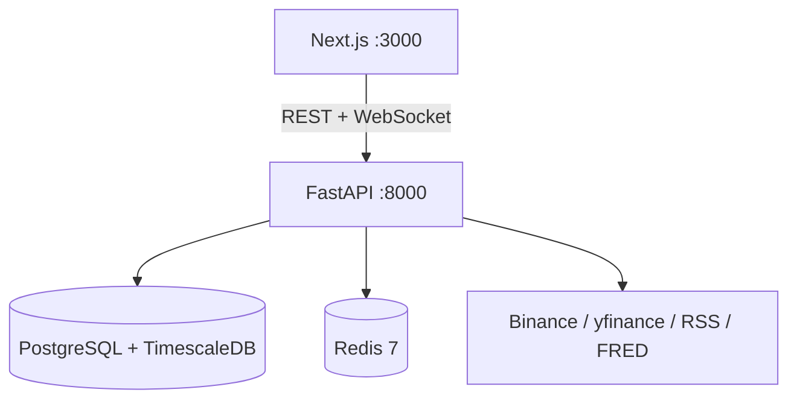

# System Architecture

LionexAI is a decoupled full-stack platform: **Next.js** frontend, **FastAPI** backend, **PostgreSQL/TimescaleDB**, and **Redis**, orchestrated with Docker.

Last updated: June 2026

---

## Container Topology



| Container | Role |
|-----------|------|
| `nexa_frontend_prod` | Next.js App Router, role-based UI |
| `nexa_backend_prod` | FastAPI, engines, schedulers, exchange adapters |
| `nexa_db_prod` | PostgreSQL 15 + TimescaleDB for `market_bars` |
| `nexa_redis_prod` | Cache, pub/sub for live market WebSocket |

---

## Backend Layers

```
API Routes (FastAPI)
    ↓
Services (business logic, validation, treasury, settlement)
    ↓
Engines (allocation, regime, macro, risk, LNX index, strategy optimizer)
    ↓
Domain Models (SQLAlchemy) + Providers (Binance, yfinance, mock)
```

Key namespaces: `/api/funds`, `/api/portfolios`, `/api/validated`, `/api/validation`, `/api/institutional`, `/api/treasury`, `/api/market`, `/api/intelligence`.

See [Backend](./backend.md) and [API Reference](../api/api_reference.md).

---

## Frontend Layers

```
App Router pages (role-specific routes)
    ↓
Components (shell, charts, intelligence widgets)
    ↓
lib/api.ts + WebSocket streams
```

JWT in cookies; middleware enforces role access. See [Frontend](./frontend.md).

---

## Execution Flow (Autonomous)

1. **Market ingestion** — hourly OHLCV into `market_bars`
2. **Regime + macro** — hourly regime detection and global market state
3. **Allocation cycle** — daily target weights per fund portfolio
4. **Algo executor** — 60s cycle via `PortfolioManager` (when `autonomous_v2_enabled`)
5. **Weekly settlement** — Monday 01:00 UTC; profit routing to treasury
6. **Validation snapshots** — every 15 minutes for operational metrics

See [AI Pipeline](./ai_pipeline.md) and [Execution (archived)](../archive/EXECUTION_ARCHITECTURE.md).

---

## Data Provenance Planes

| Plane | Storage | UI surfaces |
|-------|---------|-------------|
| `VALIDATED_HISTORICAL` | `validated_fund_runs`, strategy runs | `/fund-performance`, Research Lab |
| `DEMO` | `trades`, `equity_curves`, settlements | Client portfolios, demo validation toggle |
| `PAPER_LIVE` | Autonomous non-simulated trades | Live validation snapshots |
| `OPERATIONAL_LEDGER` | Treasury pools, transactions | `/treasury`, `/lnx` |

Validated backtests **never** mutate operational treasury balances.

---

## Scheduler Summary

| Job | Cadence |
|-----|---------|
| Validation snapshots | 15 min + daily archive 00:05 UTC |
| Market ingestion | Hourly |
| Regime + macro state | Hourly |
| Allocation cycle | Daily 00:10 UTC |
| Weekly settlement | Monday 01:00 UTC |
| LNX snapshot | Daily 02:00 UTC |
| Live validation | Every 6 hours |
| NLP sentiment | Every 10 minutes |

Full list: [Developer Setup](../guides/developer_setup.md#background-jobs).

---

## Related Docs

- [Database](./database.md)
- [AI Pipeline](./ai_pipeline.md)
- [Platform Pages Guide](../guides/platform_pages.md)
- [Deployment](../deployment/deployment.md)
