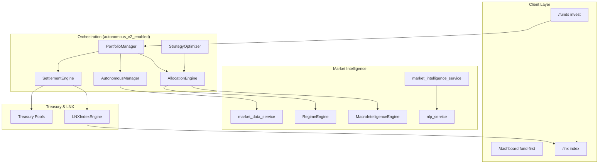

# Phase 4: Autonomous Multi-Asset AI Fund Manager + LNX Treasury Economics

**Status:** Complete (June 2026)  
**Scope:** Fund-based autonomous portfolios, treasury profit routing, LNX ecosystem index, expanded market intelligence, client fund-first UX, extended validation.

This document is the authoritative reference for everything delivered in Phase 4 (Revised). It supersedes any informal plan notes and should be read alongside [System Architecture](../architecture/system_architecture.md), [Database](../architecture/database.md), and [API Reference](../api/api_reference.md).

---

## Table of Contents

1. [Executive Summary](#1-executive-summary)
2. [Business Model & Accounting](#2-business-model--accounting)
3. [Architecture Overview](#3-architecture-overview)
4. [Database & Migrations](#4-database--migrations)
5. [Backend Services & Engines](#5-backend-services--engines)
6. [REST API Reference (Phase 4)](#6-rest-api-reference-phase-4)
7. [Scheduled Jobs & Background Tasks](#7-scheduled-jobs--background-tasks)
8. [Frontend Routes & RBAC](#8-frontend-routes--rbac)
9. [Configuration & Feature Flags](#9-configuration--feature-flags)
10. [Setup, Seed & Verification](#10-setup-seed--verification)
11. [Backward Compatibility](#11-backward-compatibility)
12. [File Index](#12-file-index)
13. [Productionization Pass (June 2026)](#13-productionization-pass-june-2026)
14. [Data Sources](#14-data-sources)

---

## 1. Executive Summary

Phase 4 transforms NEXA from a crypto-centric paper-trading terminal into an **autonomous multi-asset fund platform** where:

- Clients invest in **Lion Preserve**, **Lion Balance**, or **Lion Alpha** funds only.
- The platform selects strategies, assets, venues, and risk parameters — clients do not.
- Each fund has a **fixed weekly target return** (1% / 2.5% / 5%).
- Trading profit **above** the weekly target is routed to institutional treasury pools.
- Shortfalls are **topped up** from Yield + Reserve pools while solvent; otherwise clients receive actual PnL (logged as *uncovered*).
- A backend-computed **LNX Ecosystem Index** tracks treasury health, AUM, and platform growth.

All new behavior is gated to **`auto_managed`** fund portfolios and the **`autonomous_v2_enabled`** global flag. Legacy manually-created portfolios, the original `yield_sweep`, validation for manual trades, and existing operator/risk pages remain unchanged.

---

## 2. Business Model & Accounting

### 2.1 Guaranteed-Target, Solvency-Capped Settlement

Applies **only** to portfolios where `portfolios.auto_managed = true` (created via `POST /api/funds/{id}/invest`).

| Fund ID   | Weekly Target | Monthly Target (approx.) |
|-----------|---------------|---------------------------|
| PRESERVE  | 1.0%          | ~4.33%                    |
| BALANCE   | 2.5%          | ~10.8%                    |
| ALPHA     | 5.0%          | ~21.7%                    |

**Weekly settlement flow** (Monday 01:00 UTC, idempotent per ISO week):

```
For each auto_managed portfolio:
  opening_equity  = equity at period start (or last settlement)
  marked_equity   = live mark-to-market equity (open positions priced via market_data_service)
  period_pnl      = marked_equity - opening_equity
  target_gain     = opening_equity × (fund.target_weekly_return_pct / 100)

  IF period_pnl > target_gain:
      excess = period_pnl - target_gain
      route excess to treasury pools (split below)
      client NAV = opening_equity + target_gain

  ELIF period_pnl < target_gain:
      shortfall = target_gain - period_pnl
      topup = min(shortfall, available in YIELD + RESERVE pools)
      debit pools; client NAV += topup
      uncovered = shortfall - topup (logged if > 0)

  ELSE:
      client NAV = opening_equity + target_gain (no pool movement)

  Write ClientSettlement row + TreasuryTransaction(s) + AuditLog + EquityCurve point
  Recompute LNX index
```

After settlement, `portfolios.total_equity` equals the **client-owed NAV**. Platform float lives in treasury pools, fully auditable.

### 2.2 Profit Routing Split

Configured in `backend/app/services/settlement_constants.py`:

| Pool        | Share of Excess |
|-------------|-----------------|
| YIELD       | 40%             |
| GROWTH      | 25%             |
| RESERVE     | 15%             |
| OPERATIONS  | 15%             |
| LNX_INDEX   | 5%              |

**Shortfall top-up order:** YIELD → RESERVE (solvency-capped).

| Fund ID   | Weekly Target | Monthly Target (weekly × 4.33) | Display label (UI)        |
|-----------|---------------|--------------------------------|---------------------------|
| PRESERVE  | 1.0%          | 4.33%                          | `1% weekly · 4.33% monthly` |
| BALANCE   | 2.5%          | 10.82%                         | `2.5% weekly · 10.82% monthly` |
| ALPHA     | 5.0%          | 21.65%                         | `5% weekly · 21.65% monthly` |

**Note:** Monthly target is a simple `weekly × 4.33` approximation used for settlement display and fund cards — not compound annualized marketing copy. Both `/funds` and `/fund-performance` use these operational targets consistently.

### 2.4 Fund Target vs Actual Returns

`GET /api/funds/` (via `fund_performance_service.py`) returns both **targets** and **realized** metrics per fund:

| Field | Meaning |
|-------|---------|
| `target_weekly_return_pct` | Settlement guarantee target (1 / 2.5 / 5) |
| `target_monthly_return_pct` | `weekly × 4.33` |
| `target_return_label` | Human-readable label derived from weekly/monthly |
| `actual_weekly_return_pct` | Trailing 7D, equity-weighted across auto-managed portfolios |
| `actual_monthly_return_pct` | Trailing 30D, equity-weighted |
| `actual_total_return_pct` | `(total AUM − total principal) / principal` |
| `total_aum` | Sum of `portfolios.total_equity` for the fund |
| `portfolio_count` | Number of auto-managed portfolios |

**Frontend:** `/fund-performance` shows Target vs Actual side-by-side per fund. `/portfolios/{id}` shows portfolio-level Total Return and 7D Return from the equity curve.

### 2.5 Return Data Provenance (Demo vs Live)

| Environment | Where returns come from | “True” relative to |
|-------------|-------------------------|-------------------|
| **After `reset_institutional_demo.py`** | Seeded `trades`, `equity_curves`, `client_settlements` | Internal demo ledger (consistent with seeded PnL) |
| **After live invest + autonomous v2** | Real execution fills updating equity | Actual autonomous trades in Postgres |
| **News / market prices** | Separate from returns — used for intelligence and marking only | External RSS / Binance / yfinance |

**Verification (demo):**
```bash
docker compose -f docker-compose.prod.yml exec backend python -c "
from app.core.database import SessionLocal
from app.models import domain
db = SessionLocal()
p = db.query(domain.Portfolio).filter_by(id='LNX-PRESERVE-001').first()
pnl = sum(t.pnl or 0 for t in db.query(domain.Trade).filter_by(portfolio_id=p.pk_id, status='CLOSED'))
print('principal', p.principal, 'equity', p.total_equity, 'closed_pnl', pnl)
db.close()
"
```
Expect `equity ≈ principal + closed_pnl`. Fund-level actuals on `/fund-performance` aggregate all portfolios for that fund (equity-weighted for trailing periods).

### 2.6 Legacy Yield Sweep

`scripts/yield_sweep.py` remains for **non-auto-managed** portfolios. The new `SettlementEngine` governs auto-managed fund portfolios exclusively.

---

## 3. Architecture Overview



### 3.1 Asset Execution Layer

`backend/app/assets/__init__.py` introduces **AssetAdapter** routing:

| Asset Class   | Adapter              | Execution                         |
|---------------|----------------------|-----------------------------------|
| CRYPTO        | `CryptoAdapter`      | Binance/Bybit (LIVE + keys) or simulated |
| METAL, FX, ENERGY, EQUITY_INDEX | `SimulatedAssetAdapter` | `SimulatedAdapter` + provider prices |

`AutonomousManager._adapter_for()` delegates to this registry.

### 3.2 Central Orchestrator

`PortfolioManager` (`backend/app/services/portfolio_manager.py`) runs each 60s cycle when `autonomous_v2_enabled`:

1. Load global market state.
2. For each `auto_managed` portfolio: rebalance if due → execute trades.
3. On Mondays: trigger weekly settlement.

When `autonomous_v2_enabled` is **false**, the loop falls back to the legacy `run_autonomous_cycle()`.

---

## 4. Database & Migrations

### 4.1 Migration Chain

| Revision     | File | Purpose |
|--------------|------|---------|
| `d5f3a1b9c204` | `phase4_autonomous_fund_manager.py` | Assets, market_bars, funds, universes, allocations, rebalances, regimes, global_market_state, strategy_scores, lnx_index_snapshots; portfolio/fund columns |
| `e6a8c3d12f05` | `treasury_economics_settlements.py` | Fund weekly targets, portfolio principal/last_settled_at, client_settlements, treasury settlement FK |
| `f9c2a4e01b06` | `market_intel_news_columns.py` | market_news_articles.region, asset_classes |

Apply:

```bash
docker compose -f docker-compose.prod.yml exec backend alembic upgrade head
```

### 4.2 New / Extended Tables

**`funds`** (extended)
- `target_weekly_return_pct`, `target_monthly_return_pct`

**`portfolios`** (extended)
- `fund_pk_id`, `auto_managed`, `principal`, `last_settled_at`

**`client_settlements`** (new)
- Weekly ledger per portfolio: `opening_equity`, `period_pnl`, `target_return_pct`, `client_entitlement`, `excess_routed`, `shortfall_topup`, `uncovered`, `breakdown` JSON
- Unique index on `(portfolio_id, iso_week_key)` for idempotency

**`assets`**, **`market_bars`**, **`fund_asset_universe`**, **`portfolio_allocations`**, **`rebalance_events`**, **`market_regimes`**, **`global_market_state`**, **`strategy_scores`**, **`lnx_index_snapshots`**

**`market_news_articles`** (extended)
- `region` (e.g. US, GLOBAL), `asset_classes` JSON array

**Treasury pools** (seeded): RESERVE, YIELD, GROWTH, OPERATIONS, INSURANCE, **LNX_INDEX**

---

## 5. Backend Services & Engines

### 5.1 Market Data

| Module | Path | Role |
|--------|------|------|
| `market_data_service` | `services/market_data_service.py` | Unified bars/prices; provider registry (Binance, yfinance, mock) |
| Providers | `services/providers/` | `binance_provider`, `yfinance_provider`, `mock_provider` |

### 5.2 Allocation & Regime

| Module | Path | Role |
|--------|------|------|
| `AllocationEngine` | `engines/allocation_engine.py` | Target weights from fund universe + regime/macro tilt |
| `RegimeEngine` | `engines/regime_engine.py` | Per-asset + GLOBAL regime (BULL/BEAR/SIDEWAYS/CRISIS) |
| `MacroIntelligenceEngine` | `engines/macro_intelligence.py` | Global risk score, asset ranking; **High/HIGH impact fix** for economic events |

### 5.3 Treasury Economics

| Module | Path | Role |
|--------|------|------|
| `SettlementEngine` | `services/settlement_engine.py` | Weekly guaranteed-target settlement + pool routing |
| `settlement_constants` | `services/settlement_constants.py` | Fund targets + routing split |
| `yield_sweep` | `scripts/yield_sweep.py` | Legacy sweep (non-auto portfolios) + audit logging |

### 5.4 LNX Index

| Module | Path | Role |
|--------|------|------|
| `LNXIndexEngine` | `engines/lnx_index.py` | Composite from treasury NAV, AUM, strategy performance, reserve ratio; writes `lnx_index_snapshots` |

### 5.5 Portfolio Management & Execution

| Module | Path | Role |
|--------|------|------|
| `PortfolioManager` | `services/portfolio_manager.py` | Central orchestrator |
| `AutonomousManager` | `services/autonomous_manager.py` | Multi-asset rebalance execution via AssetAdapter |
| `AssetAdapter` | `assets/__init__.py` | Crypto vs simulated venue routing |
| `SimulatedAdapter` | `exchange/simulated.py` | Paper fills for metals/FX/indices |

### 5.6 Alpha Strategies & Optimization

| Strategy Key | Class | File |
|--------------|-------|------|
| `MOMENTUM` | MomentumStrategy | `strategies/alpha_strategies.py` |
| `TREND_FOLLOWING` | TrendFollowingStrategy | |
| `VOL_BREAKOUT` | VolatilityBreakoutStrategy | |
| `CROSS_ASSET_ROTATION` | CrossAssetRotationStrategy | |
| `RISK_PARITY` | RiskParityStrategy | |
| `SENTIMENT_OVERLAY` | SentimentOverlayStrategy | |
| `MA_CROSSOVER`, `MEAN_REVERSION` | (existing) | |

| Module | Path | Role |
|--------|------|------|
| `StrategyOptimizer` | `engines/strategy_optimizer.py` | Weekly z-score composite → `strategy_scores` |

### 5.7 Market Intelligence

| Module | Path | Role |
|--------|------|------|
| `market_intelligence_service` | `services/market_intelligence_service.py` | Multi-source RSS ingestion + dashboard payload |
| `nlp_service` | `services/nlp_service.py` | Gold/FX/commodity keywords, `GLOBAL_RISK`, economic event scoring |

**Risk Engine extensions** (`engines/risk_engine.py`):
- Block gold BUY in CRISIS regime for XAUUSD/XAGUSD
- Block high-leverage crypto BUY when `GLOBAL_RISK` sentiment is extreme

### 5.8 Validation Extensions

| Change | Detail |
|--------|--------|
| Periods | TODAY, 7D, 14D, 30D, **90D, 180D, 365D**, ALL |
| Extended metrics | Stored in `validation_snapshots.chart_data.extended_metrics`: fund_performance_pct, asset_performance_pct, treasury_growth_pct, lnx_growth_pct, client_yield_delivery_pct |

### 5.9 Backtester

`POST /api/backtest/run` reads **`market_bars`** first (multi-asset), falls back to `market_data_ohlcv` for legacy crypto data.

---

## 6. REST API Reference (Phase 4)

Base URL: `http://localhost:8000` · Auth: Bearer JWT (cookie `auth_token`)

### 6.1 Funds & Invest

| Method | Endpoint | Description |
|--------|----------|-------------|
| GET | `/api/funds/` | List active fund products with universe + weekly targets |
| GET | `/api/funds/{id}` | Fund detail |
| POST | `/api/funds/{id}/invest` | Create/update auto_managed portfolio; sets `principal` |

**Invest body:**
```json
{ "amount": 10000, "portfolio_id": "optional-custom-id" }
```

### 6.2 Assets & Market

| Method | Endpoint | Description |
|--------|----------|-------------|
| GET | `/api/assets/` | Asset registry (optional `?asset_class=CRYPTO`) |
| GET | `/api/market/global-state` | Latest global risk score, regime, asset ranking |
| GET | `/api/market/regime` | Regime history (`scope`, `history`) |
| GET | `/api/market/regime/all` | All scope regimes |

### 6.3 Portfolios (Transparency)

| Method | Endpoint | Description |
|--------|----------|-------------|
| GET | `/api/portfolios/{id}/allocations` | Target vs current weights |
| GET | `/api/portfolios/{id}/rebalances` | Rebalance event history |
| GET | `/api/portfolios/{id}/settlements` | Client weekly settlement ledger |

### 6.4 Treasury

| Method | Endpoint | Description |
|--------|----------|-------------|
| GET | `/api/treasury/pools` | All pool balances |
| GET | `/api/treasury/transactions` | General treasury ledger |
| GET | `/api/treasury/routing` | Profit-routing + top-up transactions (ops roles) |
| POST | `/api/treasury/seed` | Initialize pools (admin) |
| POST | `/api/treasury/sweep` | Legacy yield sweep |
| POST | `/api/treasury/transfer` | Inter-pool transfer (admin) |

### 6.5 LNX Index

| Method | Endpoint | Description |
|--------|----------|-------------|
| GET | `/api/lnx/index` | Current composite + weekly/monthly change |
| GET | `/api/lnx/history?limit=90` | Historical snapshots |

### 6.6 Market Intelligence Dashboard

| Method | Endpoint | Description |
|--------|----------|-------------|
| GET | `/api/market-intelligence/dashboard` | Global state, regimes, asset pulse, news feed |

### 6.7 Strategies

| Method | Endpoint | Description |
|--------|----------|-------------|
| GET | `/api/strategies/scores` | Latest weekly strategy optimizer rankings (ops roles) |

### 6.8 Validation (Extended)

| Method | Endpoint | Description |
|--------|----------|-------------|
| GET | `/api/validation/snapshots?period=90D` | Now supports 90D / 180D / 365D |
| POST | `/api/validation/reports/generate-simulation` | Uses fund `target_weekly_return_pct` when available |

---

## 7. Scheduled Jobs & Background Tasks

| Job ID | Schedule | Function |
|--------|----------|----------|
| `market_ingestion` | Every 1h | `run_market_ingestion` |
| `regime_detection` | Every 1h | `run_regime_detection` |
| `global_market_state` | Every 1h | `run_global_market_state` |
| `allocation_cycle` | Daily 00:10 UTC | `run_allocation_cycle` |
| `weekly_settlement` | Mon 01:00 UTC | `run_weekly_settlement` |
| `lnx_snapshot` | Daily 02:00 UTC | `run_lnx_snapshot` |
| `strategy_optimizer` | Mon 03:00 UTC | `run_strategy_optimizer` |
| `market_intel_ingestion` | Every 2h | `run_market_intelligence_ingestion` |
| `update_validation_snapshots` | Every 15m + daily archive 00:05 UTC | `update_validation_snapshots_job` |

**Async loop (60s):** `run_portfolio_manager_cycle()` (or legacy autonomous cycle if v2 disabled)

**Startup bootstrap:** `phase4_bootstrap()` — backfill bars → regime → macro → initial allocation

---

## 8. Frontend Routes & RBAC

### 8.1 New / Updated Client Routes

| Route | Purpose |
|-------|---------|
| `/funds` | Invest in Preserve / Balance / Alpha; **target weekly & monthly** |
| `/fund-performance` | **Target vs actual** weekly/monthly/inception returns per fund |
| `/portfolios/{id}` | Total + 7D returns, risk context, settlement history, allocation, trades |
| `/allocation` | Live allocation engine view |
| `/dashboard` | Fund-first: weekly target, treasury contributions, LNX |
| `/lnx` | LNX index, treasury NAV, AUM, reserve ratio, historical chart |
| `/market-intelligence` | Multi-asset pulse + news dashboard |
| `/simulator` | Growth projections using fund weekly targets |
| `/treasury` | Per-pool analytics + profit-routing ledger (operator/risk/admin) |
| `/validation` | 90D/180D/365D + Phase 4 extended metrics (operator/risk/admin) |

### 8.2 RBAC Allow-List (`frontend/src/middleware.ts`)

**Client:** dashboard, portfolios, funds, fund-performance, allocation, intelligence, market-intelligence, lnx, simulator

**Operator / Risk Manager:** above + treasury, validation, market-intelligence (operator)

Sidebar navigation updated in `frontend/src/components/shell/TerminalSidebar.tsx`.

### 8.3 API Client (`frontend/src/lib/api.ts`)

Exports: `fundsAPI`, `assetsAPI`, `marketAPI`, `lnxAPI`, `marketIntelligenceAPI`, `portfolioAPI.getSettlements`, `portfolioAPI.getEquityCurve`, `treasuryAPI.getRouting`, `treasuryAPI.getPoolAnalytics`

Portfolio return helpers: `computeEquityReturns()` in `frontend/src/lib/format.ts`

---

## 9. Configuration & Feature Flags

### 9.1 Global Settings

| Field | Default | Effect |
|-------|---------|--------|
| `autonomous_v2_enabled` | `false` | When `true`, enables PortfolioManager + multi-asset autonomous path |
| `environment_state` | `PAPER` | LIVE required for real crypto fills |

Enable autonomous v2:

```bash
docker compose -f docker-compose.prod.yml exec backend python scripts/seed_phase4.py --enable-autonomous
```

Or update via `PUT /api/system/settings`.

### 9.2 Seed Script

```bash
docker compose -f docker-compose.prod.yml exec backend python scripts/seed_phase4.py
```

Seeds: 10 assets, 3 funds (with weekly targets), 4000+ market bars, treasury pools (incl. LNX_INDEX), global settings.

---

## 10. Setup, Seed & Verification

### 10.1 Full Phase 4 Bootstrap

```bash
docker compose -f docker-compose.prod.yml up --build -d
docker compose -f docker-compose.prod.yml exec backend alembic upgrade head
docker compose -f docker-compose.prod.yml exec backend python scripts/seed_phase4.py
docker compose -f docker-compose.prod.yml exec frontend npx tsc --noEmit
```

### 10.2 Institutional Demo Reset (Production)

Purges demo portfolios, trades, settlements, validation data, and non-essential users while **preserving schema, migrations, and admin accounts**. Re-seeds nine institutional portfolios:

- `LNX-PRESERVE-001` … `003` (~8% monthly target, 65%+ win rate)
- `LNX-BALANCED-001` … `003` (~16–18% monthly, 60%+ win rate)
- `LNX-ALPHA-001` … `003` (~20–30% monthly, 55–60% win rate)

Includes 13 weeks of allocations, rebalances, autonomous trades, weekly settlements with treasury routing, LNX history, categorized audit logs, and validation snapshots.

```bash
docker compose -f docker-compose.prod.yml exec backend python scripts/reset_institutional_demo.py --confirm
# Optional: enable live autonomous v2 loop after seed
docker compose -f docker-compose.prod.yml exec backend python scripts/reset_institutional_demo.py --confirm --enable-autonomous
```

**Requires `--confirm`** — without it the script exits without changes.

### 10.3 End-to-End Smoke Test

```bash
# 1. Invest in Alpha fund
curl -X POST http://localhost:8000/api/funds/ALPHA/invest \
  -H "Authorization: Bearer $TOKEN" -H "Content-Type: application/json" \
  -d '{"amount": 50000}'

# 2. Check allocations
curl http://localhost:8000/api/portfolios/{portfolio_id}/allocations -H "Authorization: Bearer $TOKEN"

# 3. Force weekly settlement (optional — normally Monday 01:00 UTC)
docker compose -f docker-compose.prod.yml exec backend python -c "
from app.core.database import SessionLocal
from app.services.settlement_engine import SettlementEngine
db = SessionLocal()
print('settlements:', SettlementEngine(db).run_weekly_settlement(force=True))
db.close()
"

# 4. LNX recompute
curl http://localhost:8000/api/lnx/index -H "Authorization: Bearer $TOKEN"

# 5. Treasury routing
curl http://localhost:8000/api/treasury/routing -H "Authorization: Bearer $TOKEN"
```

**Verified (June 2026):** Migration chain applied, institutional reset (`9` portfolios, `702` trades, `117` settlements), validation snapshots for `90D`/`180D`/`365D`, settlement + LNX + treasury analytics populated, frontend `tsc` clean.

---

## 11. Backward Compatibility

| Area | Behavior |
|------|----------|
| Manual portfolios | No settlement engine; existing equity/PnL logic |
| `yield_sweep` | Still runs hourly for legacy portfolios |
| Validation | Manual/seed trades excluded (`trade_source = AUTONOMOUS` only) |
| Algo executor | Legacy path when `autonomous_v2_enabled = false` |
| All existing pages | audit, reports, stress-test, execution-monitor, etc. unchanged |
| Migrations | Additive only; no destructive drops |

---

## 12. File Index

### Backend — Core Phase 4

```
backend/
├── alembic/versions/
│   ├── d5f3a1b9c204_phase4_autonomous_fund_manager.py
│   ├── e6a8c3d12f05_treasury_economics_settlements.py
│   └── f9c2a4e01b06_market_intel_news_columns.py
├── app/
│   ├── assets/__init__.py
│   ├── engines/
│   │   ├── allocation_engine.py
│   │   ├── lnx_index.py
│   │   ├── macro_intelligence.py
│   │   ├── regime_engine.py
│   │   ├── strategy_optimizer.py
│   │   └── risk_engine.py          # multi-asset sentiment
│   ├── services/
│   │   ├── autonomous_manager.py
│   │   ├── portfolio_manager.py
│   │   ├── settlement_engine.py
│   │   ├── settlement_constants.py
│   │   ├── fund_performance_service.py
│   │   ├── market_data_service.py
│   │   ├── market_intelligence_service.py
│   │   ├── audit_service.py
│   │   ├── audit_constants.py
│   │   ├── nlp_service.py
│   │   └── validation_service.py   # 90D/180D/365D + extended metrics
│   ├── strategies/
│   │   ├── alpha_strategies.py
│   │   └── __init__.py             # STRATEGY_MAP
│   ├── api/routes/
│   │   ├── assets.py, funds.py, market.py, lnx.py
│   │   ├── market_intel.py, portfolios.py, treasury.py
│   │   └── backtest.py             # market_bars first
│   └── main.py                     # schedulers + portfolio manager loop
└── scripts/
    ├── seed_phase4.py
    ├── reset_institutional_demo.py
    └── yield_sweep.py
```

### Frontend — Phase 4

```
frontend/src/
├── app/
│   ├── funds/page.tsx
│   ├── fund-performance/page.tsx
│   ├── allocation/page.tsx
│   ├── market-intelligence/page.tsx
│   ├── lnx/page.tsx
│   ├── treasury/page.tsx
│   ├── dashboard/page.tsx
│   ├── simulator/page.tsx
│   └── validation/page.tsx
├── components/
│   ├── intelligence/GlobalMarketIntelligence.tsx
│   ├── intelligence/AllocationPanel.tsx
│   ├── intelligence/SettlementHistoryPanel.tsx
│   └── shell/TerminalSidebar.tsx
├── lib/api.ts
├── lib/format.ts                  # computeEquityReturns()
└── middleware.ts
```

---

## 13. Productionization Pass (June 2026)

Post–Phase 4 polish for institutional demos, transparency, and operational clarity. **No Phase 4 features were re-implemented** — this pass integrated, seeded, and exposed existing functionality.

### 13.1 Institutional Demo Reset

**Script:** `backend/scripts/reset_institutional_demo.py`

| Action | Detail |
|--------|--------|
| Purges | Portfolios, trades, settlements, allocations, rebalances, validation snapshots/history, audit logs, LNX snapshots; non-preserving users |
| Preserves | Schema, migrations, admin/operator/risk + client1–3 accounts |
| Re-seeds | 9 portfolios (`LNX-PRESERVE/BALANCED/ALPHA-001…003`), 13 weeks trades, settlements, treasury routing, LNX history, audit logs |
| Validation | Runs `update_validation_snapshots_job()` after seed |

```bash
python scripts/reset_institutional_demo.py --confirm
python scripts/reset_institutional_demo.py --confirm --enable-autonomous  # optional live loop
```

### 13.2 Audit Trail Cleanup

- **Categories** in `audit_constants.py`: Trading, Treasury, Settlement, Allocation, Rebalance, Risk, Infrastructure, System
- Auto `category` in audit metadata; filter via `GET /api/audit?category=Treasury`
- **Coalesced** `EXCHANGE_RECONNECTED` (6h window) + aggregated `INFRASTRUCTURE_HEALTH_SUMMARY`

### 13.3 Settlement & Treasury Visibility

- Enriched settlements: `starting_nav`, `trading_pnl`, `target_yield`, `treasury_routed`, `shortfall_topups`, `lnx_contribution`
- `GET /api/treasury/pools/analytics` — per-pool balance, contributions, withdrawals, net flow, growth
- UI: `SettlementHistoryPanel` on portfolio detail; treasury analytics table on `/treasury`

### 13.4 LNX Dashboard

- `GET /api/lnx/index` extended: `treasury_nav`, `aum`, `reserve_ratio`
- `/lnx` page shows full metrics row + historical curve

### 13.5 Validation Expansion

- Periods: 90D, 180D, 365D (snapshots + PDFs)
- `chart_data.extended_metrics`: fund performance, asset performance, treasury growth, LNX growth, client yield delivery
- Validation UI renders Phase 4 metrics panel

### 13.6 Fund Performance Alignment

- Removed legacy annual marketing labels (`4–8% / yr`) in favor of operational weekly/monthly targets
- `fund_performance_service.py` computes actual returns for API + `/fund-performance`
- Portfolio detail: readable risk context layout + return badges

---

## 14. Data Sources

### 14.1 Market Prices & OHLCV

Configured per asset in `seed_phase4.py` → `assets.data_provider`:

| Provider | Assets | Used for |
|----------|--------|----------|
| **binance** | BTC/USDT, ETH/USDT, SOL/USDT | Live prices, OHLCV, crypto execution |
| **yfinance** | XAUUSD, XAGUSD, WTIUSD, SPX, NDX, EURUSD, GBPUSD | Prices/OHLCV for simulated venue |
| **mock** | Fallback | When provider unavailable |

Service: `market_data_service.py` → `providers/` (BinanceProvider, YFinanceProvider, MockProvider). Bars stored in `market_bars`.

### 14.2 News & Market Intelligence

| Source | Ingestion | Content |
|--------|-----------|---------|
| **CoinDesk RSS** | `scripts/scrape_news.py` (hourly via `main.py`) | Crypto headlines |
| **Investing.com FX RSS** | `market_intelligence_service.ingest_news_feeds` | FX news |
| **Investing.com Commodities RSS** | Same | Metals/energy news |
| **Demo seed** | `seed_demo_environment.py` / empty DB | Placeholder articles |

NLP sentiment runs on ingested articles (`nlp_service.py`). Dashboard: `GET /api/market-intelligence/dashboard`.

### 14.3 What Does NOT Feed Portfolio Returns

Portfolio and fund returns are computed from **`equity_curves`** and **`trades`** in Postgres — not from news RSS or external return APIs. In demo mode these are seeded; in live mode they update via autonomous execution and settlement.

---

## Related Documents

- [ALPHA_OPTIMIZATION_PROGRAM.md](./ALPHA_OPTIMIZATION_PROGRAM.md) — Grid optimization & best config selection
- [INSTITUTIONAL_PERFORMANCE_REPORT.md](./INSTITUTIONAL_PERFORMANCE_REPORT.md) — Post-optimization validated results
- [HISTORICAL_VALIDATION_AUDIT.md](./HISTORICAL_VALIDATION_AUDIT.md) — Demo vs validated surfaces
- [BRAND_GUIDE.md](../guides/brand_guide.md) — Logo colors for presentations
- [VALIDATION_REPORT.md](./VALIDATION_REPORT.md) — Base validation framework
- [EXECUTION_ARCHITECTURE.md](./EXECUTION_ARCHITECTURE.md) — Exchange adapters & audit events
- [FEATURES_DEEP_DIVE.md](./FEATURES_DEEP_DIVE.md) — NLP & risk gatekeeper (pre–Phase 4)
- [DEMO_GUIDE.md](../guides/demo_guide.md) — Persona demos (extend with fund invest flow)

---

*Last updated: June 2026 · Phase 4 + Alpha Optimization + validation hardening.*
