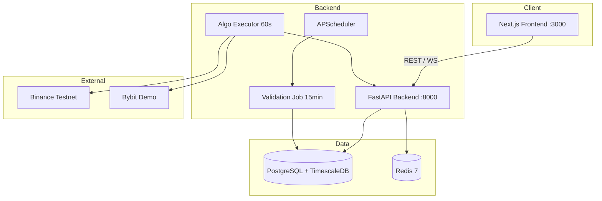

# NEXA System Architecture

High-level architecture overview. For detailed flows see [ARCHITECTURE.md](./ARCHITECTURE.md) and [EXECUTION_ARCHITECTURE.md](./EXECUTION_ARCHITECTURE.md).

Last updated: June 2026

---

## Container Topology



---

## Core Subsystems

| Subsystem | Location | Purpose |
|-----------|----------|---------|
| Risk Engine | `app/services/risk_engine.py` | Pre-trade mandate validation |
| Exchange Layer | `app/exchange/` | Binance/Bybit CCXT adapters |
| Algo Executor | `scripts/algo_executor.py` | Autonomous strategy execution |
| Validation Engine | `app/services/validation_service.py` | Rolling metrics + daily archive |
| Analytics | `app/services/analytics_service.py` | Strategy/portfolio compare, trade search |
| PDF Reports | `app/services/validation_report_service.py` | Institutional PDF generation |
| Intelligence | `app/services/nlp_service.py` | News sentiment + gatekeeper |
| Treasury | `app/services/treasury_service.py` | Capital pools + yield sweep |

---

## Data Flow: Autonomous Trade → Validation

```
Strategy Signal (algo_executor)
    → Risk Engine (pass/reject)
    → Exchange Adapter (Binance/Bybit)
    → Trade record (AUTONOMOUS + metadata)
    → Audit Log
    → validation_service (every 15 min)
    → validation_snapshots (live)
    → validation_snapshot_history (daily archive)
    → /validation UI + PDF reports
```

---

## Frontend Application Map

| Area | Routes |
|------|--------|
| Client | `/dashboard`, `/portfolios`, `/funds`, `/simulator`, `/lnx` |
| Quant / Operator | `/backtest`, `/strategies`, `/execution-monitor`, `/execution-health` |
| Risk / Compliance | `/mandates`, `/stress-test`, `/validation`, `/audit` |
| Analytics (Stage 5) | `/trade-explorer`, `/analytics/compare`, `/reports`, `/executive` |

Navigation: `frontend/src/components/shell/TerminalSidebar.tsx`

---

## API Route Registration

Registered in `backend/app/main.py`:

| Prefix | Router |
|--------|--------|
| `/api/validation` | Validation snapshots, history, PDFs |
| `/api/analytics` | Strategy analytics, compare tools |
| `/api/trades` | Trade explorer |
| `/api/exchange` | Exchange status & orders |
| `/api/execution` | Execution health stats |
| `/api/audit` | Enhanced audit trail |

Full catalog: [API Reference](../api/api_reference.md)

---

## Database: Validation Tables

| Table | Role |
|-------|------|
| `trades` | Source data with `trade_source`, `exchange`, latency, strategy |
| `validation_snapshots` | Live rolling metrics cache |
| `validation_snapshot_history` | Daily append-only archive (730 days) |

See [Database](../architecture/database.md) for full schema.

---

## Institutional Validation Roadmap

| Stage | Status | Key Deliverable |
|-------|--------|-----------------|
| 1 | ~95% | Trade capture + rolling stats |
| 2 | ~95% | Validation dashboard |
| 3 | ~90% | Institutional PDF reports |
| 4 | ~95% | Continuous engine + archive |
| 5 | ~85% | Trade explorer + analytics compare |

Details: [VALIDATION_ROADMAP_STATUS.md](./VALIDATION_ROADMAP_STATUS.md)

---

## Deployment Stack

- **Docker Compose**: `docker-compose.prod.yml`
- **Reverse Proxy**: Nginx + Let's Encrypt (production)
- **Migrations**: Alembic auto-run on startup
- **Frontend rebuild required** after UI changes in prod compose

See [Deployment](../deployment/deployment.md) and [Developer Setup](../guides/developer_setup.md).
